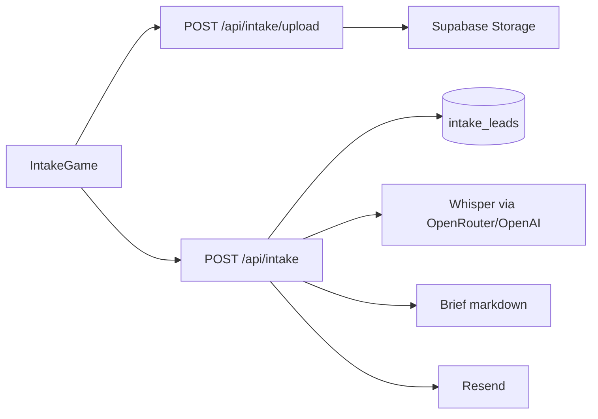

# TWM Advisory — Documentation projet

Site marketing / acquisition pour **TWM Advisory** : conseil, produits et agents IA en production.  
Repo : `twm-advisory` · Stack : **Next.js 16**, **React 19**, **Tailwind 4**, **Supabase**, **OpenRouter/OpenAI**, **Resend**.

---

## 1. Positionnement

- **Promesse** : de la stratégie à la production — opérateur embarqué, pas un vendeur de slides.
- **Fil rouge** : audit → déploiement → mesure → extension.
- **Ton** : direct, terrain, FR/EN (i18n client).
- **CTA principal** : « Lancer le briefing » → `/demarrer`.

---

## 2. Stack technique

| Couche | Choix |
|--------|--------|
| Framework | Next.js `16.2.12` (App Router) |
| UI | React `19.2.4`, Tailwind CSS 4 |
| Contenu | `src/lib/content.ts` (FR/EN) |
| Backend data | Supabase (Postgres + Storage), **service role serveur uniquement** |
| IA | OpenRouter (préféré) ou OpenAI — chat + Whisper |
| Email | Resend |
| Validation API | Zod |
| Langues | FR (défaut) / EN (`?lang=en` + localStorage) |

### Scripts

```bash
npm run dev
npm run build
npm start
npm run lint
```

---

## 3. Variables d’environnement

Voir `.env.example` (ne jamais committer `.env`).

| Variable | Rôle |
|----------|------|
| `NEXT_PUBLIC_SITE_URL` | URL canonique SEO |
| `NEXT_PUBLIC_CONTACT_EMAIL` | Contact / fallback notify |
| `NEXT_PUBLIC_LINKEDIN_URL` | Schema / social |
| `NEXT_PUBLIC_TWITTER_HANDLE` | Twitter cards |
| `NEXT_PUBLIC_FOUNDER_NAME` | Schema Person |
| `NEXT_PUBLIC_SUPABASE_URL` | **Origin seule** (`https://xxx.supabase.co`) — pas `/rest/v1/` |
| `NEXT_PUBLIC_SUPABASE_ANON_KEY` | Réservée |
| `SUPABASE_SERVICE_ROLE_KEY` | Lectures/écritures serveur |
| `OPENROUTER_API_KEY` | Brief + STT (préféré) |
| `OPENROUTER_CHAT_MODEL` | défaut `openai/gpt-4o-mini` |
| `OPENROUTER_STT_MODEL` | défaut `openai/whisper-1` |
| `OPENAI_API_KEY` | Fallback si pas OpenRouter |
| `RESEND_API_KEY` | Emails internes |
| `INTAKE_NOTIFY_EMAIL` | Destinataire briefs / partenaires |
| `INTAKE_FROM_EMAIL` | Expéditeur Resend |

---

## 4. Architecture des routes

### Pages marketing (`src/app/(site)/`)

| Route | Rôle |
|-------|------|
| `/` | Home (hero, problem, features, offers teaser, architecture, FAQ, CTA) |
| `/approche` | Méthode |
| `/offres` | 5 offres + fil rouge + écosystème |
| `/signal` | Index « Signal » (contenu éditorial) |
| `/signal/[slug]` | Article Signal |
| `/partenaires` | Socle BD / partenariats + formulaire |
| `/architecture` | L’entreprise agentique (15 agents) |
| `/a-propos` | Fondateur, fit, écosystème teaser, veille |
| `/faq` | FAQ |
| `/demarrer` | Parcours jeu de qualification client |
| `/contact` | Soft CTA → briefing + mailto |

### APIs

| Route | Méthode | Rôle |
|-------|---------|------|
| `/api/intake/upload` | `POST` (FormData) | Upload vidéo → bucket `intake-videos` |
| `/api/intake` | `POST` (JSON) | Crée lead, Whisper, brief IA, email |
| `/api/partners` | `POST` (JSON) | Crée lead partenaire, email |

### Autres

- `src/middleware.ts` — `?splash=1` force le splash
- `src/app/sitemap.ts`, `robots.ts`, `manifest.ts`, `opengraph-image.tsx`
- Favicons : `icon.png`, `apple-icon.png`, `favicon.ico`

---

## 5. Parcours produit clés

### 5.1 Offres (ordre figé)

1. Audit IA de ton organisation
2. Déploiement d’agents
3. Audit & certification de tes systèmes IA
4. Accompagnement stratégique (incl. direction IA à temps partagé)
5. Formation & sensibilisation (Conférence / Atelier / Acculturation)

Pas de tarifs / durées inventés.

### 5.2 `/demarrer` — briefing jeu

```
Intro → Intention → 3 micro-défis → Carte + score
→ Signal (vidéo 60–90s OU texte) → Identité + consentement
→ API → Brief IA → Email → Confirmation (créneau sous 48h)
```

- Score maturité **déterministe** (`src/lib/intake.ts`)
- Query `?intent=` préremplit l’intention (depuis Signal)
- Pas de calendrier embed (créneau par email)

### 5.3 Signal

Format : **1 insight · 1 verdict · corps court · CTA briefing**.  
Articles seed dans `src/lib/signal.ts`.

### 5.4 Partenaires

Page publique (pourquoi, 4 types, règles, formulaire).  
Types : apporteur / tech / métier / co-delivery / autre.  
Pas de logos inventés, commercial « sur accord écrit ».

---

## 6. Supabase

Migrations : `supabase/migrations/`

### `intake_leads`

Champs : lang, intent, answers (jsonb), score, entry_offer, name, email, company, signal_text, video_path, transcript, brief_md, consent_at, status (`received` | `briefed` | `emailed`).

Bucket privé : **`intake-videos`**.

### `partner_leads`

Champs : lang, name, email, company, partner_type, message, consent_at, status (`received` | `emailed` | `archived`).

**RLS** : deny-all pour `anon`/`authenticated` ; accès via **service_role** uniquement.

Appliquer :

```bash
npx supabase link --project-ref <ref>
npx supabase db push
```

ou coller le SQL dans le SQL Editor (dans l’ordre).

Détails : [`supabase/README.md`](supabase/README.md).

---

## 7. Structure du code

```
src/
  app/
    (site)/          # pages marketing + shell Header/Footer
    api/intake/       # upload + submit briefing
    api/partners/    # leads partenaires
    layout.tsx       # root (theme, splash SSR, fonts)
    globals.css      # design tokens
  components/
    intake/          # IntakeGame, PathMap, ScoreMeter, VideoSignal
    Signal*.tsx
    Partnerships.tsx
    …                # Hero, Offers, SplashIntro, etc.
  lib/
    content.ts       # copy FR/EN
    intake*.ts       # scoring, brief, email
    signal.ts
    partner-email.ts
    supabase/server.ts
    seo.ts, i18n.tsx, theme.tsx
supabase/
  migrations/
  README.md
public/
  logo.png
  uploads/           # assets hero / about
```

---

## 8. Design system (résumé)

- Tokens CSS : `--bg`, `--fg`, `--accent` (bronze), `--muted`, `--panel`, etc.
- Themes switchables (`ThemeProvider` / `data-theme`)
- Composants : `glass-card`, `btn-primary`, `btn-secondary`, `Reveal`, `SectionLabel`
- Fonts : display (Playfair), sans (Inter), mono (JetBrains)
- Splash session cookie `twm-splash-seen`

---

## 9. SEO

- Metadata pages + JSON-LD (`buildJsonLd` dans `seo.ts`)
- `serviceType` aligné sur les 5 offres
- Sitemap inclut Signal posts + `/partenaires` + `/demarrer`
- i18n alternates `?lang=en`

---

## 10. Flux de données (briefing)



---

## 11. Commits récents (repères)

- `4f4f424` — Partenaires / BD lead capture
- `9db52d0` — Intake game, Signal, parcours offres
- `2cc94cf` — Logo + splash intro

---

## 12. Gaps connus / prochaines pistes

- **Images** : peu d’ancrage photo (hero généré + portrait WhatsApp) — besoin hero full-bleed + covers Signal + portrait pro
- **Calendrier** : créneau toujours manuel (email 48h)
- **OpenRouter** : clé à renseigner dans `.env` pour briefs IA live
- **Blog « hyper intelligent »** : V1 Signal en place ; pas encore de génération/distribution auto
- **Admin** : lecture leads via Supabase Studio (pas de dashboard custom)

---

## 13. Checklist mise en prod

1. Remplir `.env` (Supabase origin correcte, Resend, OpenRouter)
2. Appliquer les 2 migrations SQL
3. Tester `/demarrer` bout-en-bout (texte puis vidéo)
4. Tester `/partenaires` formulaire
5. Vérifier email reçu sur `INTAKE_NOTIFY_EMAIL`
6. `npm run build` puis deploy (Vercel ou équivalent) + env vars plateforme

---

*Doc alignée sur l’état du repo (août 2026).*
